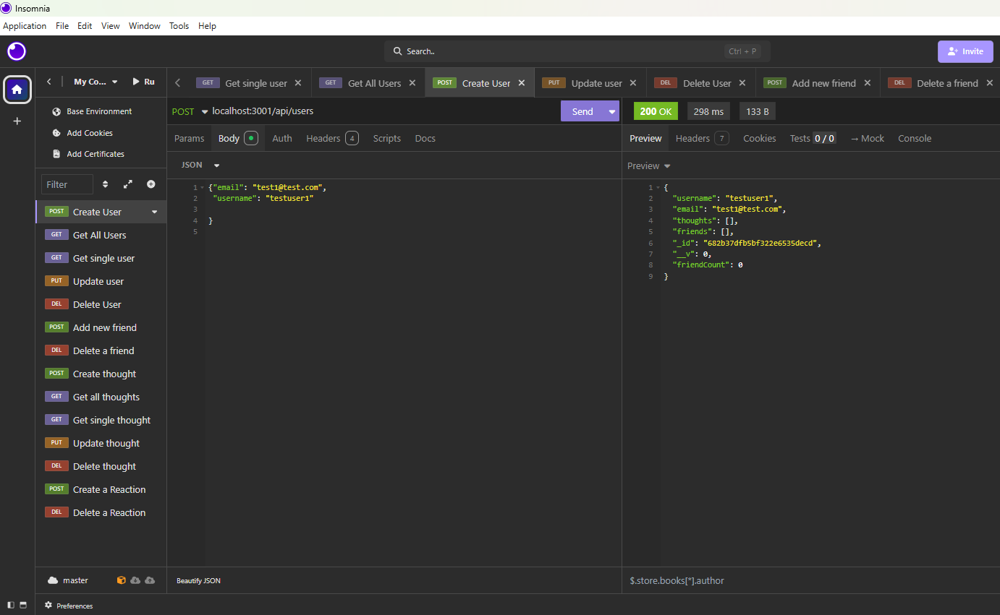
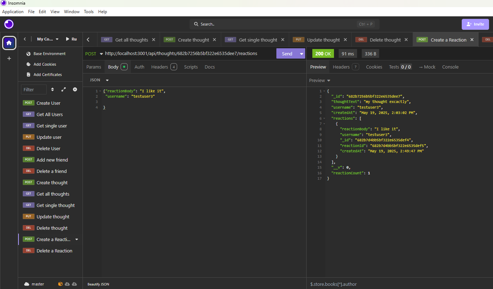

# API Social Networking

## Description
The Social Network API application is a built API using noSQL database to implement a social network web app, and throughout the app users can create new user such as a friends list, delete friends, modify and share thoughts also reactions. These API routes were tested witin Insomnia.

Within Insomnia performed POST,GET,PUT and Delete routes.






## Installation
```
The Installation entails using Express.js for routing, MongoDB database, API, Mongoose ODM, Javascript and Github.

## Usage
```
The usage of this application shows API being built within noSQL database and being able to test these API routes via Insomnia to make changes to the database and or add to it.

## Contributing

Users can contact me to discuss any further advice, input and or collboration efforts for team building opportunites. 

## Tests
```test included running terminal commands NPM I and NPM run start to connect to MongoDB Socialmedia manage, from there can perform POST,GET,PUT and Delete routes via Insomnia. 
```

## Contact, Github and Demovideo information

For any questions, contact me at [via Email](mailto:dreamgardens24@gmail.com).  
GitHub: [Miyako24](https://github.com/Miyako24/API-Social-Networking) # API-Social_Networking
DemoVideo: [Miyako24]() # API-Social_Networking